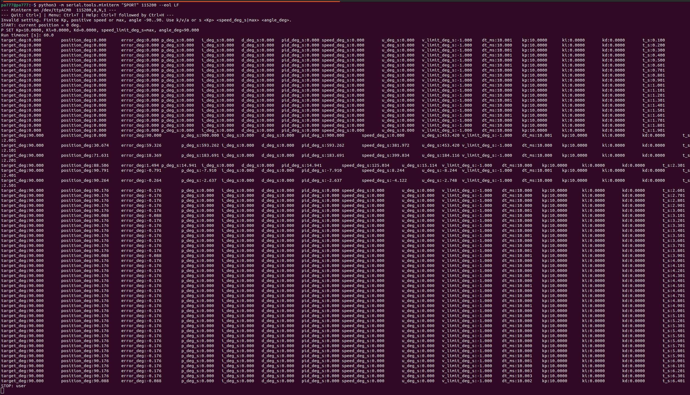
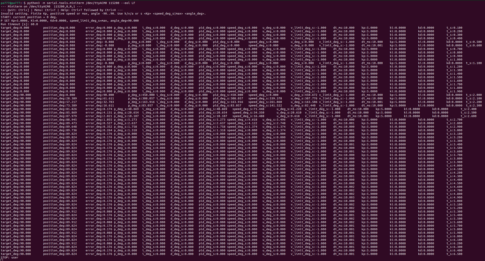
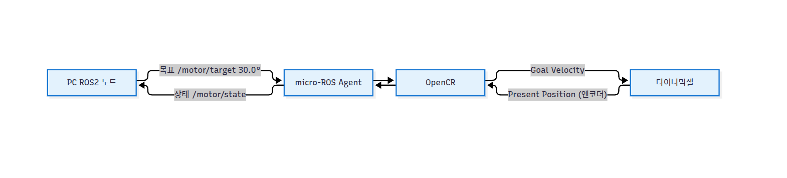

# 모듈 1 : OpenCR, 다이나믹셀 통합 4문제 

## 문제 1 : 목표 입력과 응답 확인
라즈베리파이의 원격 수행 환경을 구성하고, OpenCR에 펌웨어를 업로드한 뒤 한 개의 작은 상대 목표각에 대한 응답을 기록하세요. 목표값·측정값·제어 출력과 단위를 구분하고 실제 움직임을 설명하세요.

### 1. 환경과 필수 도구

- 라즈베리 호스트 명 : pa777
- 우분투 버전 : 22.04.5 LTS
- 아키텍처 : ARM64
- 접속 포트 : /dev/ttyACM0 (dialout 그룹 권한 확인)

### 2. 펌웨어 업로드 

- Board : OpenCR R1.0
- 빌드 사용량 : 프로그램 104,296 bytes (13%), 전역 40,620 bytes

### 3. 실행

| 항목 | 값 |
|---|---|
| 모터 모델 | 다이나믹셀 XM430-W210 (모델 1030) |
| 모터 ID / 통신 | ID 1, 1 Mbps, Protocol 2.0 |
| 예제 | opencr_position_p (P 위치 제어) |
| 게인 | Kp = 10.0 (Ki = 0, Kd = 0) |
| 목표각 | 90° (시작 0°, 2초 후 목표 적용) |
| 속도 상한 | max |

| 이름 | 로그 필드 | 의미 | 단위 |
|---|---|---|---|
| 목표값 | target_deg | 지령 각도 | ° |
| 측정값 | position_deg | 엔코더 현재 각도 | ° |
| 오차 | error_deg | 목표 − 현재 | ° |
| 제어 출력 | u_deg_s | 모터에 전달한 목표 각속도 | °/s |

목표 변경(2초) 이후 측정 기록 :

| t_s | target_deg | position_deg | error_deg | u_deg_s |
|---|---|---|---|---|
| 2.001 | 90.000 | 0.000 | 90.000 | 453.420 |
| 2.101 | 90.000 | 30.674 | 59.326 | 453.420 |
| 2.201 | 90.000 | 71.631 | 18.369 | 184.116 |
| 2.301 | 90.000 | 88.506 | 1.494 | 15.114 |
| 2.401 | 90.000 | 90.791 | -0.791 | -8.244 |
| 2.501 | 90.000 | 90.264 | -0.264 | -2.748 |
| 2.601 | 90.000 | 90.176 | -0.176 | 0.000 |
| 6.401 | 90.000 | 90.088 | -0.088 | 0.000 |

### 4. 결과 해석
2초 후 목표 90°가 적용되자 P 출력(Kp×오차)이 커서 초기에는 모터 속도 상한(u = 453.420°/s)에 포화되어 급가속. 현재각은 약 0.3초 만에 88.5°까지 상승했고, 관성으로 90.791°까지 오버슈팅한 뒤 반대 방향 속도로 보정되었다. 오차가 데드밴드(0.2°) 안으로 들어온 뒤 제어 출력이 0이 되어 90.088°(오차 −0.088°)에서 정지했으며, 마지막에 x 입력으로 STOP(정지)을 확인했다. 최종적으로 목표 90°에 근접.

## 문제 2 : 오차와 피드백 해석
실행 A의 초기·중간·마지막 시점에서 목표각과 현재각을 선택하고 오차 = 목표각 - 현재각을 계산하세요. 오차 크기의 변화를 설명하고, 위치 측정값을 얻는 센서와 OpenCR까지의 통신 경로를 적으세요. 목표가 +30°이고 현재각이 +35°인 경우의 오차 부호와 양의 Kp에 의한 보정 방향을 설명하세요.

### 시점 별 오차 계산

| 시점 | 경과 시간 | 목표각 | 현재각 | 위치오차 |
|---|---|---|---|---|
| 초기 (목표 변경 직후) | 2.001 s | 90.000 | 0.000 | +90.000 |
| 중간 (오버 슈팅) | 2.401 s | 90.000 | 90.791 | -0.791 |  
| 마지막 (정상 상태) | 6.401 s | 90.000 | 90.088 | -0.088 |

- 초기 (t = 2.001 s) : 목표 각도가 급격히 바뀌면서 최대 오차 발생. P 제어에 의해 제어 되며 모터가 급가속.
- 중간 (t = 2.401 s) : 모터가 관성에 의해 현재각이 목표각 $90^\circ$를 넘어 $90.791^\circ$까지 도달하는 오버 슈팅 발생. 이로 인해 오차 부호가 음수로 바뀌게 되며 반대 방향의 속도($u = -8.244^\circ/\text{s}$)를 생성하며 모터를 회전.
- 마지막 ( t  = 6.401 s ) : 감쇠 과정을 거쳐 모터가 목표각에 도착. 오차는 $-0.088^\circ$로 매우 작으며 펌웨어의 DEADBAND_RAD인 0.2 이내로 진입하여 정지 상태 유지.

### 센서/통신 경로
- **센서** : 다이나믹셀 XM430-W210 내장 비접촉 마그네틱 앱솔루트 엔코더. 모터 내부 MCU가 회전량을 Present Position 값으로 관리.
- **통신 경로** :
  엔코더 → 모터 내부 MCU(Present Position 레지스터)
  → TTL 반이중(half-duplex) 시리얼, Protocol 2.0, 1 Mbps
  → OpenCR 다이나믹셀 3핀 TTL 포트(펌웨어의 Serial3 + 방향제어 핀)
- 펌웨어는 `dxl.readControlTableItem(PRESENT_POSITION)`으로 틱 값을 읽고, `RAD_PER_TICK = 2π / 4096`을 곱해 각도(°)로 변환한 뒤 오차 계산에 사용.

### 보정 방향
$$e = \theta_{\text{target}} - \theta_{\text{current}} = +30^\circ - (+35^\circ) = -5^\circ \quad (\text{음수, } -)$$

P 제어 수식 $u = K_p \times e$에서 $K_p > 0$이고 $e = -5^\circ < 0$이므로, 출력 속도 명령 $u$는 음수($-$)가 됨.
양의 회전 방향을 기준으로 목표보다 $+5^\circ$ 더 많이 돌아간 오버슈트 상태이므로, 음의 각속도 명령은 모터를 역방향으로 회전시킴.
이로 인해 현재 각도가 $+35^\circ$에서 감소하여 목표값인 $+30^\circ$에 도달하도록 제어하는 Negative Feedback 복원 동작을 수행.

## 문제 3 : P 게인 변경에 따른 응답 비교
제공 P 제어 예제에서 과제용으로 검증된 두 Kp 설정으로 실행 A와 B를 비교하세요. 목표각·속도 상한·부하·측정 주기를 유지하고, 시작 자세와 이동 여유를 맞추세요. 두 기록의 같은 경과 시간에서 현재각과 목표 초과 여부를 비교하고, 차이를 근거와 함께 설명하세요.

변경한 게인이 OpenCR 위치 제어 게인인지 다이나믹셀 내부 게인인지 구분하고 I항과 D항의 역할을 각각 한 문장으로 설명하세요. 최적 게인 탐색이나 I·D 튜닝은 요구하지 않습니다.

### 실행 조건과 비교
| 항목 | 실행 A | 실행 B |
|---|---|---|
| Kp | 10.0 | 5.0 |
| 목표각 | 90° | 90° |
| 속도 상한 | max | max |

실행 A 출력
 

실행 B 출력
 

### 같은 경과 시간에서의 현재각, 목표 초과 비교
| t_s | A 현재각(°) Kp=10 | B 현재각(°) Kp=5 | 비고 |
|---|---|---|---|
| 2.1 | 30.674 | 28.389 | 둘 다 상승 중 |
| 2.3 | 88.506 | 73.389 | A가 더 빠름 |
| 2.4 | 90.791 | 81.826 | A 오버슈팅(목표 초과), B 미도달 |
| 2.6 | 90.176 | 87.979 | A 초과 후 복귀, B 접근 중 |
| 최종(정지) | 90.088 (오차 -0.088) | 89.824 (오차 0.176) | A만 오버슈팅 발생 |

### 차이 해석
- 제어 출력 u = Kp $\times$ 오차이므로 Kp가 큰 A는 같은 오차에서 더 큰 속도를 명령해 목표에 빠르게 도달. 그러나 목표 각도 근처에서도 속도가 커서 관성으로 90도를 지나 90.791도까지 오버 슈팅한 이후에 반대 방향으로 보정. 

- 상대적으로 Kp가 작은 B는 속도 명령이 A에 비해 완만해서 목표 각도까지 도달은 느리지만 오버슈팅 없이 접근함. 

- Kp를 키우면 오버슈팅 위험이 커지는 P 제어의 특성을 확인할 수 있음.

###  I·D 및 게인 위치
이번에 변경한 Kp는 OpenCR 위치 제어 게인. 다이나믹셀 내부 게인이 아니고 다이나믹셀은 내부 PI 루프만 사용.

- **I항** : 시간에 따른 누적 오차를 활용하여 정상 상태 오차 제거하는 역할.
- **D항** : 오차의 변화율을 활용하여 오버슈팅과 제어 감쇠 역할.

## 문제 4 : 제어와 통신의 역할 해석
아래는 답안 작성을 위한 가상 기록의 일부이며 실제 실행 결과가 아닙니다. 설명용 인터페이스의 목표와 현재값 단위는 °입니다. 기존 8강의 RPM 속도 인터페이스와 구분하세요.

| 항목 | 설명용 조건·기록 |
|---|---|
| 제어 계산 | OpenCR에서 10ms마다 수행 |
| 상태 발행 | 100ms마다 수행 |
| 0.0초 | PC가 /motor/target에 30.0 발행 |
| 0.1초 | PC가 /motor/state에서 2.0 수신 |
| 0.5초 | PC가 /motor/state에서 12.0 수신 |
| 1.0초 | PC가 /motor/state에서 22.0 수신 |
| 2.0초 | PC가 /motor/state에서 29.0 수신 |

PC ROS2 노드·micro-ROS Agent·OpenCR·다이나믹셀을 연결한 구조도에 목표 전달과 측정값 반환 방향을 표시하세요. 목표와 상태를 보내고 받는 주체를 설명하세요. 상태 발행 한 주기 동안 제어 계산이 몇 번 수행되는지 계산하고, 통신 단절 시 오래된 명령을 어떻게 처리할지 정책과 이유를 적으세요.

### 구조도

### 송수신 주체

- **목표 /motor/target** : PC ros2 노드가 발행, OpenCR의 micro-ros가 구독
- **상태 /motor/state**  : OpenCR이 발행, PC ros2가 구독
- OpenCR은 수신한 목표로 제어 계산을 수행해 다이나믹셀을 구동, 엔코더 측정값을 상태로 발행 

### 주기 비교
- 제어 계산 주기 = 10ms, 상태 발행 주기 = 100ms ->  상태 발행 1주기 동안 제어계산 횟수 : 100 / 10 = 10회

### 통신 단절 시 오래된 명령 처리 정책

- **정책** : 마지막 목표를 무한정 추종하지 않고 일정 시간 안에 새 명령이 오지 않으면 오래된 목표를 만료 처리하고 모터 속도를 0으로 만들어 정지
- **이유** : 오랜된 명령은 현재 상황과 맞지 않을 수 있고 최신 피드백 없이 계속 구동하면 위험

