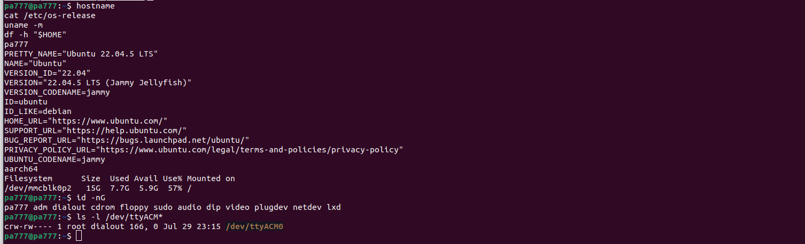
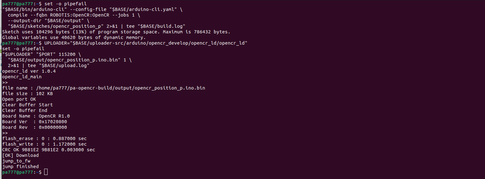

# 모듈 1 : OpenCR, 다이나믹셀 통합 4문제 

## 문제 1 : 목표 입력과 응답 확인
라즈베리파이의 원격 수행 환경을 구성하고, OpenCR에 펌웨어를 업로드한 뒤 한 개의 작은 상대 목표각에 대한 응답을 기록하세요. 목표값·측정값·제어 출력과 단위를 구분하고 실제 움직임을 설명하세요.

### 1. 환경과 필수 도구

- 라즈베리 호스트 명 : pa777
- 우분투 버전 : 22.04.5 LTS
- 아키텍처 : ARM64
- 접속 포트 : /dev/ttyACM0 (dialout 그룹 권한 확인)

### 2. 펌웨어 업로드 

- Board : OpenCR R1.0
- 빌드 사용량 : 프로그램 104,296 bytes (13%), 전역 40,620 bytes

### 3. 실행

| 항목 | 값 |
|---|---|
| 모터 모델 | 다이나믹셀 XM430-W210 (모델 1030) |
| 모터 ID / 통신 | ID 1, 1 Mbps, Protocol 2.0 |
| 예제 | opencr_position_p (P 위치 제어) |
| 게인 | Kp = 10.0 (Ki = 0, Kd = 0) |
| 목표각 | 90° (시작 0°, 2초 후 목표 적용) |
| 속도 상한 | max |

| 이름 | 로그 필드 | 의미 | 단위 |
|---|---|---|---|
| 목표값 | target_deg | 지령 각도 | ° |
| 측정값 | position_deg | 엔코더 현재 각도 | ° |
| 오차 | error_deg | 목표 − 현재 | ° |
| 제어 출력 | u_deg_s | 모터에 전달한 목표 각속도 | °/s |

목표 변경(2초) 이후 측정 기록 :

| t_s | target_deg | position_deg | error_deg | u_deg_s |
|---|---|---|---|---|
| 2.001 | 90.000 | 0.000 | 90.000 | 453.420 |
| 2.101 | 90.000 | 30.674 | 59.326 | 453.420 |
| 2.201 | 90.000 | 71.631 | 18.369 | 184.116 |
| 2.301 | 90.000 | 88.506 | 1.494 | 15.114 |
| 2.401 | 90.000 | 90.791 | -0.791 | -8.244 |
| 2.501 | 90.000 | 90.264 | -0.264 | -2.748 |
| 2.601 | 90.000 | 90.176 | -0.176 | 0.000 |
| 6.401 | 90.000 | 90.088 | -0.088 | 0.000 |

### 4. 결과 해석
2초 후 목표 90°가 적용되자 P 출력(Kp×오차)이 커서 초기에는 모터 속도 상한(u = 453.420°/s)에 포화되어 급가속. 현재각은 약 0.3초 만에 88.5°까지 상승했고, 관성으로 90.791°까지 오버슈팅한 뒤 반대 방향 속도로 보정되었다. 오차가 데드밴드(0.2°) 안으로 들어온 뒤 제어 출력이 0이 되어 90.088°(오차 −0.088°)에서 정지했으며, 마지막에 x 입력으로 STOP(정지)을 확인했다. 최종적으로 목표 90°에 근접.

## 문제 2. 오차와 피드백 해석

### 시점 별 오차 계산

| 시점 | 경과 시간 | 목표각 | 현재각 | 위치오차 |
|---|---|---|---|---|
| 초기 (목표 변경 직후) | 2.001 s | 90.000 | 0.000 | +90.000 |
| 중간 (오버 슈팅) | 2.401 s | 90.000 | 90.791 | -0.791 |  
| 마지막 (정상 상태) | 6.401 s | 90.000 | 90.088 | -0.088 |

- 초기 (t = 2.001 s) : 목표 각도가 급격히 바뀌면서 최대 오차 발생. P 제어에 의해 되며 모터가 급가속.
- 중간 (t = 2.401 s) : 모터가 관성에 의해 현재각이 목표각 $90^\circ$를 넘어 $90.791^\circ$까지 도달하는 오버 슈팅 발생. 이로 인해 오차 부호가 음수로 바뀌게 되며 반대 방향의 속도($u = -8.244^\circ/\text{s}$)를 생성하며 모터를 회전.
- 마지막 ( t  = 6.401 s ) : 감쇠 과정을 거쳐 모터가 목표각에 도착. 오차는 $-0.088^\circ$로 매우 작으며 펌웨어의 DEADBAND_RAD인 0.2 이내로 진입하여 정지 상태 유지.

### 센서, 통신 경로
- **센서** : 다이나믹셀 XM430-W210 내장 비접촉 마그네틱 앱솔루트 엔코더. 모터 내부 MCU가 회전량을 Present Position 값으로 관리.
- **통신 경로** :
  엔코더 → 모터 내부 MCU(Present Position 레지스터)
  → TTL 반이중(half-duplex) 시리얼, Protocol 2.0, 1 Mbps
  → OpenCR 다이나믹셀 3핀 TTL 포트(펌웨어의 Serial3 + 방향제어 핀)
- 펌웨어는 `dxl.readControlTableItem(PRESENT_POSITION)`으로 틱 값을 읽고, `RAD_PER_TICK = 2π / 4096`을 곱해 각도(°)로 변환한 뒤 오차 계산에 사용.

### 보정 방향
$$e = \theta_{\text{target}} - \theta_{\text{current}} = +30^\circ - (+35^\circ) = -5^\circ \quad (\text{음수, } -)$$

P 제어 수식 $u = K_p \times e$에서 $K_p > 0$이고 $e = -5^\circ < 0$이므로, 출력 속도 명령 $u$는 음수($-$)가 됨.
양의 회전 방향을 기준으로 목표보다 $+5^\circ$ 더 많이 돌아간 오버슈트 상태이므로, 음의 각속도 명령은 모터를 역방향으로 회전시킴.
이로 인해 현재 각도가 $+35^\circ$에서 감소하여 목표값인 $+30^\circ$에 도달하도록 제어하는 Negative Feedback 복원 동작을 수행.

